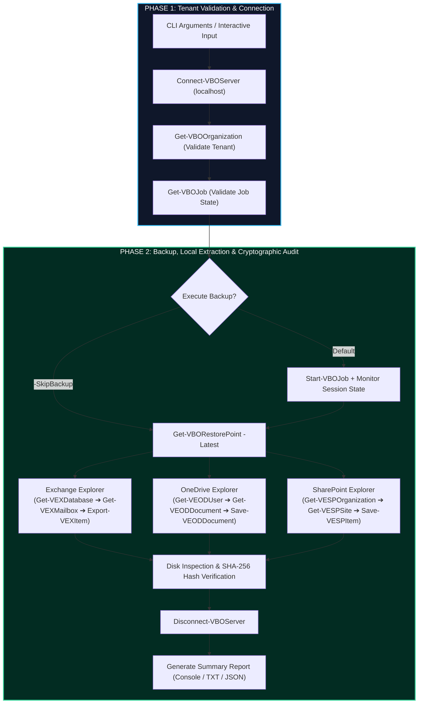

<div align="center">

# ⚡ Veeam M365 Export Automation
### *Automated Backup & Out-of-Place Sample Restore Verification for Microsoft 365*

[](https://microsoft.com/powershell)
[](https://www.veeam.com)
[](https://microsoft.com)
[](#)
[](#)

*A deterministic, non-destructive PowerShell automation engine designed to validate Veeam Backup for Microsoft 365 (VB365) restore points by extracting random real-world samples directly to secure local storage with cryptographic integrity validation.*

---

[📖 Overview](#-1-overview--simple-explanation) • [🔬 Technical Deep-Dive](#-2-technical-deep-dive) • [🚀 How-to-Use Guide](#-3-how-to-use-manual) • [📊 Sample Report](#-4-sample-output) • [🛠️ Troubleshooting](#-5-troubleshooting)

---

</div>

<br />

## 🧭 Table of Contents
- [📖 1. Overview & Simple Explanation](#-1-overview--simple-explanation)
  - [The Problem We Solve](#the-problem-we-solve)
  - [The Zero-Risk Philosophy](#the-zero-risk-philosophy)
  - [Key Benefits at a Glance](#key-benefits-at-a-glance)
- [🔬 2. Technical Deep-Dive](#-2-technical-deep-dive)
  - [High-Level Architecture](#high-level-architecture)
  - [The Two-Phase Lifecycle](#the-two-phase-lifecycle)
  - [Workload Extraction Internals](#workload-extraction-internals)
    - [1. Exchange Online (`.msg`)](#1-exchange-online-msg)
    - [2. OneDrive for Business](#2-onedrive-for-business)
    - [3. SharePoint Online](#3-sharepoint-online)
  - [Integrity & Proof Engine (SHA-256)](#integrity--proof-engine-sha-256)
  - [Audit Trail & Evidence Structure](#audit-trail--evidence-structure)
- [🚀 3. How-to-Use Manual](#-3-how-to-use-manual)
  - [Prerequisites](#prerequisites)
  - [Quick Start](#quick-start)
  - [CLI Parameter Reference](#cli-parameter-reference)
  - [Usage Scenarios](#usage-scenarios)
- [📊 4. Sample Output](#-4-sample-output)
- [🛠️ 5. Troubleshooting](#-5-troubleshooting)
- [📜 License](#-license)

---

<br />

## 📖 1. Overview & Simple Explanation

### The Problem We Solve
Managed Service Providers (MSPs) and Enterprise IT teams are required to prove that backups are not just running, but actually **recoverable**. Traditionally, this means a technician must log in each month, browse backups manually, restore an email and some files, check if they open, write a ticket or certificate, and repeat this for every tenant. 

This manual procedure is:
- **Time-Consuming:** Consumes dozens of engineering hours every month.
- **Error-Prone:** Subject to inconsistent checks and lack of reproducible proof.
- **Risky:** Inadvertent restores back to original cloud production can overwrite active user files or trigger unwanted notifications.

### The Zero-Risk Philosophy
This automation takes a radically safe approach:

> [!IMPORTANT]
> **Zero Cloud Alteration:** The script never writes, alters, or touches active cloud production data in Microsoft 365. 
> 
> Instead, it extracts one random sample per workload (Exchange, OneDrive, SharePoint) directly from the backup repository and saves it onto a controlled directory on the local Veeam server disk.

By verifying the extracted files locally through cryptographic hashes (`SHA-256`) and filesystem checks, you receive mathematical, auditable proof that the backup database is healthy, the Veeam Explorers can unpack items, and the files are 100% usable.

### Key Benefits at a Glance
| Feature | Benefit |
| :--- | :--- |
| 🛡️ **100% Non-Destructive** | Restores occur out-of-place directly to server disk. Zero production risk. |
| 🎲 **Uniform Random Sampling** | Dynamically samples real user items, preventing biased or hardcoded checks. |
| ⚡ **2-Phase Streamlined Execution** | Automates both backup completion and multi-workload extraction in one step. |
| 🔒 **Cryptographic Proof** | Calculates SHA-256 checksums and validates file sizes for hard evidence. |
| 📋 **Instant Audit Reporting** | Generates human-readable console output, text logs, and JSON artifacts. |

---

<br />

## 🔬 2. Technical Deep-Dive

### High-Level Architecture



### The Two-Phase Lifecycle

#### Phase 1: Preflight & Environment Lockdown
1. **Target Directory Preparation:** Allocates a run-scoped directory tagged with UTC timestamp (`C:\VeeamRestoreLocalTest\YYYYMMDD_HHMMSS`).
2. **Module Bootstrap:** Dynamically detects and imports `Veeam.Archiver.PowerShell`.
3. **Session Handshake:** Connects via authenticated local loopback (`localhost:9191`).
4. **Tenant & Job Discovery:** Resolves target organizational identifiers against Veeam's local database.

#### Phase 2: Orchestrated Backup, Extract & Verify
1. **Synchronous Backup Engine:** Invokes `Start-VBOJob` and actively monitors `Get-VBOJobSession` until a terminal status (`Success` or `Warning`) is reached.
2. **Restore Point Resolution:** Queries `Get-VBORestorePoint -Job $job -Latest`, safely inspecting `.BackupTime` to freeze snapshot context.
3. **Parallel Explorer Harvesting:**
   - Isolated sessions are spun up individually with `try/finally` scope guarantees.
   - Sessions are terminated strictly using their respective `Stop-V*Session` cmdlets even in failure scenarios to prevent memory leakage or repository file locks.

---

### Workload Extraction Internals

```
┌──────────────────────────────────────────────────────────────────────────────┐
│ WORKLOAD RECOVERY MECHANISMS                                                 │
├─────────────────┬──────────────────────────────────┬─────────────────────────┤
│ Workload        │ Veeam Command Chain              │ Target Artifact         │
├─────────────────┼──────────────────────────────────┼─────────────────────────┤
│ 📬 Exchange     │ Get-VEXDatabase                  │ Standalone RFC-822/MSG  │
│                 │   ➔ Get-VEXMailbox               │ container file (.msg)   │
│                 │   ➔ Export-VEXItem               │                         │
├─────────────────┼──────────────────────────────────┼─────────────────────────┤
│ ☁️ OneDrive     │ Get-VEODUser                     │ Native document file    │
│                 │   ➔ Get-VEODDocument -Recurse    │ (.docx, .pdf, .xlsx)    │
│                 │   ➔ Save-VEODDocument            │                         │
├─────────────────┼──────────────────────────────────┼─────────────────────────┤
│ 🌐 SharePoint   │ Get-VESPOrganization             │ Native document file    │
│                 │   ➔ Get-VESPSite -Recurse        │ (.docx, .pdf, .png)     │
│                 │   ➔ Get-VESPDocumentLibrary      │                         │
│                 │   ➔ Save-VESPItem                │                         │
└─────────────────┴──────────────────────────────────┴─────────────────────────┘
```

#### 1. Exchange Online (`.msg`)
- Queries internal JET/EDB databases via `Get-VEXDatabase`.
- Traverses mailboxes while omitting system artifacts (`DiscoverySearchMailbox*`, deleted or archived mailboxes).
- Filters for user messages belonging to class `IPM.Note*`.
- Performs native item export via `Export-VEXItem -Item $email -To $localPath -Force`.

#### 2. OneDrive for Business
- Queries personal site storage drives via `Get-VEODUser`.
- Recursively parses user document structures using `Get-VEODDocument -Recurse`.
- Enforces strict candidate verification (rejects containers/folders and items without valid file extensions).
- Extracts directly to disk using `Save-VEODDocument -Document $doc -Path $localPath`.

#### 3. SharePoint Online
- Enumerates sites through `Get-VESPOrganization` $\rightarrow$ `Get-VESPSite -Recurse`.
- Skips structural/system libraries (`SitePages`, `Site Assets`, `Style Library`, `Form Templates`, `User Photos`).
- Filters out system Web forms (`.aspx`, `.master`).
- Extracts documents via `Save-VESPItem -Document $doc -Path $localPath -Force`.

---

### Integrity & Proof Engine (SHA-256)
A restore cannot be certified simply because a cmdlet returned code `0`. For each extracted file:
1. **Physical Presence:** Tested via `Test-Path`.
2. **Non-Zero Byte Guard:** Enforces `FileInfo.Length > 0`.
3. **Cryptographic Checksum:**
   $$\text{Hash} = \text{SHA-256}(B_{\text{file}})$$
   Calculated using `Get-FileHash -Algorithm SHA256`.

---

### Audit Trail & Evidence Structure
Runs produce structured, reproducible artifacts within the designated root:

```text
C:\VeeamRestoreLocalTest\
└── 20260917_115627/
    ├── Exchange/
    │   └── Your Microsoft 365 Business Standard...msg
    ├── OneDrive/
    │   └── OneDrive-Test-003.pdf (ver.2.0).pdf
    ├── SharePoint/
    │   └── OneDrive-Test-002.docx.docx
    ├── Report_Summary.txt       <-- Formatted text summary
    └── Report_Summary.json      <-- Machine-readable audit record
```

---

<br />

## 🚀 3. How-to-Use Manual

### Prerequisites
- **Operating System:** Windows Server 2016 / 2019 / 2022 / 2025.
- **PowerShell:** PowerShell 7.0 or higher.
- **Product:** Veeam Backup for Microsoft 365 (v8.x or v8.6+).
- **Execution Rights:** Local Administrator with access to the Veeam PowerShell console.

---

### Quick Start

1. Open **Veeam Backup for Microsoft 365 PowerShell** as **Administrator**.
2. Navigate to the repository directory:
   ```powershell
   Set-Location "C:\path\to\veeam-m365-export-automation"
   ```
3. Run the script:
   ```powershell
   .\Invoke-SimpleM365BackupRestoreTest.ps1 `
       -OrganizationName "yourtenant.onmicrosoft.com" `
       -JobName "Your-Backup-Job-Name"
   ```

---

### CLI Parameter Reference

| Parameter | Type | Default | Description |
| :--- | :---: | :---: | :--- |
| `-OrganizationName` | `String` | *Interactive Prompt* | Primary domain of the M365 tenant (e.g., `israk.onmicrosoft.com`). |
| `-JobName` | `String` | *Interactive Prompt* | Name of the Veeam Backup Job to run or inspect. |
| `-LocalRestoreRoot` | `String` | `C:\VeeamRestoreLocalTest` | Local directory on the Veeam server for exported samples. |
| `-SkipBackup` | `Switch` | `False` | Bypasses job execution; tests extraction against the latest existing point. |

---

### Usage Scenarios

#### Scenario A: Complete Monthly Automated Test (Backup + Restore)
Initiates a fresh backup job, waits for completion, and tests local extraction:
```powershell
.\Invoke-SimpleM365BackupRestoreTest.ps1 `
    -OrganizationName "israk.onmicrosoft.com" `
    -JobName "VB365-LAB-M365-Backup"
```

#### Scenario B: Quick Diagnostics (Skip Backup)
Validates existing restore points without initiating a new backup pass:
```powershell
.\Invoke-SimpleM365BackupRestoreTest.ps1 `
    -OrganizationName "israk.onmicrosoft.com" `
    -JobName "VB365-LAB-M365-Backup" `
    -SkipBackup
```

#### Scenario C: Custom Storage Destination
Directs test exports to a designated forensic or high-capacity volume:
```powershell
.\Invoke-SimpleM365BackupRestoreTest.ps1 `
    -OrganizationName "israk.onmicrosoft.com" `
    -JobName "VB365-LAB-M365-Backup" `
    -LocalRestoreRoot "F:\ForensicAudits\September2026"
```

---

<br />

## 📊 4. Sample Output

```text
======================================================================
     REPORT CONCLUSIVO: TEST BACKUP & RESTORE LOCALE VEEAM M365
======================================================================
Data/Ora Run        : 17/09/2026 11:56:50
Organizzazione      : israk.onmicrosoft.com
Job di Backup       : VB365-LAB-M365-Backup
Esito Backup        : Success
Restore Point Usato : 09/17/2026 09:21:22
Cartella Locale     : C:\VeeamRestoreLocalTest\20260917_115627

----------------------------------------------------------------------
DETTAGLIO RESTORE CAMPIONI (COPIA SU PUNTO LOCALE MACCHINA VEEAM):
----------------------------------------------------------------------
[1] EXCHANGE ONLINE (EMAIL)
    - Esito       : SUCCESSO
    - Casella     : israksarker@israk.onmicrosoft.com
    - Oggetto     : Your Microsoft 365 Business Standard subscription...
    - File Locale : ...\Exchange\Your Microsoft 365 Business Standard...msg
    - Dimensione  : 228352 bytes
    - Checksum    : CA221140B3D72A35AE921C8FA00BBABB0C7A2B03F194BF7B...

[2] ONEDRIVE FOR BUSINESS (FILE)
    - Esito       : SUCCESSO
    - Utente      : source01
    - File        : OneDrive-Test-003.pdf.pdf
    - File Locale : ...\OneDrive\OneDrive-Test-003.pdf (ver.2.0).pdf
    - Dimensione  : 104070 bytes
    - Checksum    : DA8E797BB9302A1091CC8B889B9B96922C4AAA305463245B...

[3] SHAREPOINT ONLINE (DOCUMENTO)
    - Esito       : SUCCESSO
    - Sito / Lib  : SourceData / Documents
    - Documento   : OneDrive-Test-002.docx.docx
    - File Locale : ...\SharePoint\OneDrive-Test-002.docx.docx
    - Dimensione  : 29157 bytes
    - Checksum    : BF2EAFC0A150F6105635E2BCB3A154D5D312468966F97247...

======================================================================
ESITO COMPLESSIVO OPERAZIONE: TUTTO ANDATO A BUON FINE (SUCCESS)
======================================================================
```

---

<br />

## 🛠️ 5. Troubleshooting

<details>
<summary><b>1. Error: <code>Cannot connect to Veeam Backup for Microsoft 365 server</code></b></summary>
<br />

- **Cause:** Script was executed from standard Windows PowerShell or without elevated administrative permissions.
- **Remedy:** Launch **Veeam Backup for Microsoft 365 PowerShell** from the Start Menu as Administrator.
</details>

<details>
<summary><b>2. Error: <code>The property 'CreationTime' cannot be found</code></b></summary>
<br />

- **Cause:** Older scripts referenced `CreationTime`, which is absent on Veeam 8.6 restore point objects.
- **Remedy:** Ensure you are using the latest version of `Invoke-SimpleM365BackupRestoreTest.ps1`, which queries `.BackupTime`.
</details>

<details>
<summary><b>3. Error: <code>A parameter cannot be found that matches parameter name 'Wait'</code></b></summary>
<br />

- **Cause:** VB365's `Start-VBOJob` does not support `-Wait`.
- **Remedy:** The current script replaces `-Wait` with active background polling via `Get-VBOJobSession`.
</details>

---

<br />

## 📜 License
This project is licensed under the [MIT License](LICENSE). Built for enterprise backup reliability and automated compliance audits.
