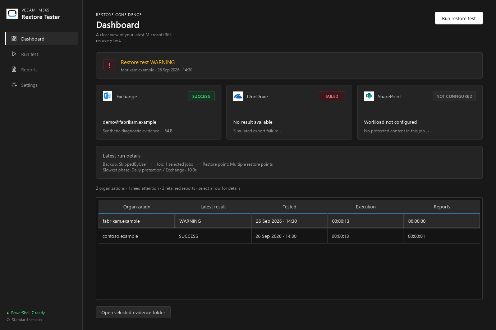
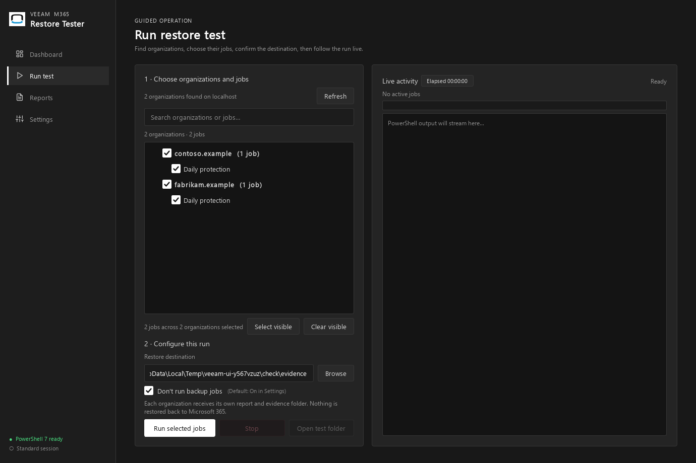

# Veeam M365 Restore Tester

Applicazione Windows per verificare i restore point di Veeam Backup for Microsoft 365 con esportazioni **locali e fuori posto**. Versione **1.3.1**.

[Scarica il portable ZIP](https://media.githubusercontent.com/media/israk101/veeam-m365-export-automation/main/portable/VeeamM365RestoreTester-1.3.1-portable.zip) · [Manuale tecnico](docs/index.html) · [Riferimento funzioni](docs/reference.html) · [SHA-256](portable/SHA256SUMS.txt)



*Schermate generate dall'app corrente con dati sintetici: nessun dato di tenant incluso.*

## Avvio

1. Scarica lo ZIP da `portable/` ed estrai **tutta** la cartella `VeeamM365RestoreTester`.
2. Mantieni l'EXE e `_internal` insieme. Esegui `VeeamM365RestoreTester.exe` sul server Veeam e approva l'elevazione Windows.
3. In **Run test**, seleziona organizzazioni e job. Con **Don't run backup jobs** attivo vengono usati i restore point esistenti; disattivalo per eseguire prima nuovi backup.
4. Avvia il test e consulta Dashboard/Reports. Ogni organizzazione riceve una cartella finale indipendente.

Servono Windows, PowerShell 7 nel `PATH`, il modulo `Veeam.Archiver.PowerShell`, i Veeam Explorer dei workload selezionati, privilegi appropriati e spazio locale scrivibile. Python e Qt sono inclusi nel portable; Veeam e PowerShell sono prerequisiti esterni. Impostazioni: `%APPDATA%\VeeamM365RestoreTester\settings.json`.

## Cosa fa

- Esporta un campione valido per workload disponibile: messaggio Exchange, documento OneDrive, documento SharePoint.
- Controlla esistenza, dimensione maggiore di zero e calcola SHA-256; ritenta fino a 25 candidati per workload.
- Esegue fino a **2 organizzazioni contemporaneamente** per default (1–4 configurabili), mantenendo sequenziali i job della stessa organizzazione.
- Esamina una finestra di **100 candidati** per sorgente; `0` permette enumerazione completa. Il campione rapido non è uniforme sull'intero contenuto.
- Produce JSON obbligatorio e TXT/HTML/PDF selezionabili; conserva il numero configurato di sessioni per organizzazione (default 5).
- Non ripristina oggetti nel tenant. L'opzione backup avvia il normale job Veeam; non effettua restore cloud.



## Evidenze e conservazione

```text
C:\VeeamRestoreLocalTest\
└── contoso.example\
    └── RestoreTest_YYYYMMDD_HHMMSS\
        ├── Report_Summary.json
        ├── Report_Summary.txt / .html / .pdf  (formati selezionati)
        ├── restore email\
        ├── restore one drive\
        └── restore share point\
```

Le cartelle dei workload compaiono quando esistono file da conservare. La retention elimina le sessioni più vecchie della singola organizzazione; annullamenti ed errori di report lasciano separatamente il workspace `Batch_*` per recupero. Un successo verifica il campione esportato, non ogni oggetto protetto.

## Risultati misurati

Nei report della VM del 26 settembre 2026: circa **7,1 s** per Exchange, **11,3 s** per Exchange + OneDrive, **32 s** per tutti e tre i workload, inclusa la generazione report, usando backup esistenti. Il run con nuovi backup ha impiegato **29 min 12 s**, di cui **28 min 22 s** nei job Veeam. Non è un confronto controllato con la versione precedente né una misura multi-organizzazione. Il [manuale](docs/index.html#timings) spiega come leggere e confrontare i tempi.

## Repository e distribuzione

| Percorso | Contenuto necessario |
|---|---|
| `main.py`, `app.py`, `core/`, `ui/` | Applicazione e componenti Python |
| `scripts/` | Unica copia dei tre script PowerShell |
| `assets/` | Sole immagini e icone usate dall'app/report |
| `portable/` | ZIP pronto, checksum e manifest della release |
| `docs/` | Manuale HTML, riferimento funzioni e schermate attuali |
| `tests/`, `tools/`, `build.ps1` | Verifica, generazione documentazione e build riproducibile |

Il portable contiene solo runtime, risorse operative e avvisi di licenza: nessun test, sorgente di sviluppo, vecchio EXE, manuale, screenshot o dato di backup. I moduli QML inutilizzati sono esclusi; Chromium rimane necessario ai PDF. La vecchia copia dello script in radice e il pacchetto EXE singolo sono stati rimossi.

## Sviluppo e build

```powershell
py -3.12 -m venv .venv
.\.venv\Scripts\python.exe -m pip install -r requirements-dev.txt
.\.venv\Scripts\python.exe -m pytest -q
.\.venv\Scripts\python.exe tools\capture_ui.py
.\.venv\Scripts\python.exe tools\build_reference.py
.\build.ps1
```

La build produce `portable\VeeamM365RestoreTester\` e lo ZIP versionato. La cartella estratta è ignorata da Git; lo ZIP è gestito da **Git LFS**. Dopo un clone esegui `git lfs pull`; lo ZIP sorgenti automatico di GitHub può contenere un puntatore LFS: usa il link di download diretto sopra.

Controllo offline del pacchetto, senza Veeam, con destinazione nuova:

```powershell
.\VeeamM365RestoreTester.exe --self-test C:\Temp\VeeamCheck-01
Get-Content C:\Temp\VeeamCheck-01\result.json
```

Genera report sintetici, verifica PDF e salva quattro schermate. Non sostituisce il test dei cmdlet sulla VM. Il [manuale tecnico](docs/index.html) documenta anche CLI PowerShell, contratti, errori e limiti.

Licenza dell'app: [MIT](LICENSE). Dipendenze: [avvisi di terze parti](THIRD_PARTY_NOTICES.txt).
