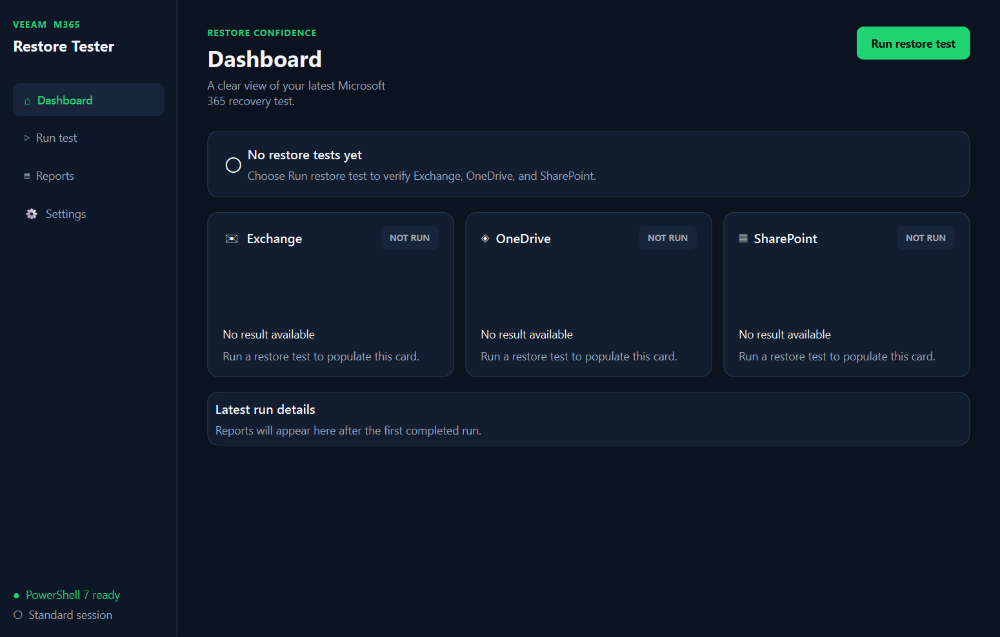

# Veeam M365 Restore Tester

> A Windows desktop application for repeatable, non-destructive verification of Veeam Backup for Microsoft 365 restore points.

[](version_info.txt)
[](https://www.microsoft.com/windows)
[](https://learn.microsoft.com/powershell/)
[](https://www.python.org/)
[](https://doc.qt.io/qtforpython-6/)
[](LICENSE)

Veeam M365 Restore Tester discovers organizations and backup jobs from the local Veeam Backup for Microsoft 365 server, runs selected verification jobs sequentially, restores representative Exchange, OneDrive and SharePoint items to local storage, validates the extracted files and produces evidence reports.

The restore destination is always local. The application does **not** restore data into Microsoft 365 and does not modify tenant content.



## Documentation

Choose the shortest path for what you need:

| Goal | Start here |
|---|---|
| Install and run the packaged application | [Quick start](#quick-start) |
| Understand a test result | [Results and status model](#results-and-status-model) |
| Operate, troubleshoot or deploy the application | [Complete HTML manual](docs/index.html) |
| Understand or modify the implementation | [Architecture reference](docs/ARCHITECTURE.md) |
| Run only the PowerShell engine | [PowerShell CLI](#powershell-cli) |
| Build or test from source | [Development](#development) |

The HTML manual is self-contained: download the repository and open `docs/index.html` in any modern browser. It includes prerequisites, deployment, UI walkthroughs, exact runtime flows, component responsibilities, data contracts, reporting, retention, security, troubleshooting and maintenance guidance.

## What it verifies

For every selected organization/job pair, the engine can optionally run the backup job and then opens its latest restore point. It attempts one locally restored, non-empty sample from each available workload:

- **Exchange Online:** exports one message as evidence.
- **OneDrive for Business:** exports one document.
- **SharePoint Online:** exports one document.

Each accepted file must exist, have a size greater than zero and produce a SHA-256 hash. Empty folders, folder-like objects, stale items and failed exports are skipped; another randomized candidate is attempted up to the configured PowerShell limit (25 by default).

This is a sampling test. A successful run demonstrates that representative content could be opened and extracted from the tested restore point; it is not an exhaustive validation of every protected object.

Restore-point identity is fail-safe: the engine requests the latest restore point for the exact selected job. If none exists, that queue item fails instead of falling back to a different job in the same organization.

## Key capabilities

- Automatic, read-only discovery of local Veeam organizations and jobs.
- Fast organization/job search that filters the existing tree without reconnecting to Veeam or losing checked selections.
- Multi-organization and multi-job execution through a deterministic sequential queue.
- Optional backup execution, or faster testing of existing restore points.
- Responsive GUI with live PowerShell output, current phase and elapsed time.
- Isolated per-job workspaces and one final evidence/report directory per organization.
- Mandatory machine-readable JSON plus optional TXT, self-contained HTML and PDF reports.
- English result vocabulary across report surfaces: `SUCCESS`, `WARNING`, `FAILED` and `NOT CONFIGURED`.
- Configurable per-organization retention.
- Portable PyInstaller `onedir` distribution for faster startup than a self-extracting one-file package.
- Job-bound restore-point lookup that fails safely instead of using another job's organization-level restore point.

## Prerequisites

The application must run on the machine that hosts, or can locally administer, the Veeam Backup for Microsoft 365 installation used for the test.

| Requirement | Why it is needed |
|---|---|
| Windows 10/11 or Windows Server 2016+ | Supported desktop/runtime environment. |
| Veeam Backup for Microsoft 365 8.x/8.6 | Provides the server, restore points and Explorer APIs. |
| `Veeam.Archiver.PowerShell` | Organization, job, backup and restore-point operations. |
| Relevant Veeam Explorers | Exchange, OneDrive and SharePoint item restore sessions. |
| PowerShell 7 (`pwsh.exe`) in `PATH` | Executes discovery and restore scripts. |
| Local administrator approval | The packaged executable requests elevation through its manifest. |
| Write access to the restore root | Stores restored samples and reports. |

Python is needed only for source development. It is bundled in the portable distribution.

## Quick start

### 1. Get the portable application

Clone/download the repository, or use a packaged release. The current portable output has this shape:

```text
dist\VeeamM365RestoreTester\
├── VeeamM365RestoreTester.exe
└── _internal\
```

Keep the executable and `_internal` together. To distribute the application, ZIP the entire `VeeamM365RestoreTester` directory—not only the `.exe`.

The repository also retains a compatibility **single-file** `VeeamM365RestoreTester.exe`. It is standalone and current, but starts more slowly because it must extract Python, Qt and Chromium at launch. The `onedir` package above is the recommended distribution for routine use.

### 2. Start and discover

1. Run `VeeamM365RestoreTester.exe` and approve the UAC prompt.
2. Wait for the local inventory to load. Use **Refresh inventory** if Veeam configuration changed after launch.
3. Search by organization or job name if the server contains a large inventory.

### 3. Configure and run

1. Check one or more jobs.
2. Choose the local restore root.
3. Leave **Don't run backup jobs** checked to test the latest existing restore points. Clear it to run each selected backup job first.
4. Select **Run selected jobs**.
5. Follow the current job, phase, elapsed time and live output. Selected jobs run one at a time.

### 4. Review evidence

After completion, open the output from the dialog, Dashboard or Reports tab. JSON is always written for application history; TXT, HTML and PDF are controlled in Settings.

For deployment details and validation checks, see the [installation guide in the HTML manual](docs/index.html#deployment).

## How multi-job execution works

The checked tree is converted into an ordered queue of `(organization, job)` pairs. The GUI starts one PowerShell process per pair and does not start the next item until the current process exits. Sequential execution avoids competing Veeam Explorer sessions and keeps every log line, temporary file and report attributable to one job.

```text
checked jobs
  → PendingJob queue
  → job 1: optional backup → restore tests → per-job JSON
  → job 2: optional backup → restore tests → per-job JSON
  → ...
  → group completed jobs by organization
  → copy representative evidence
  → write one final report set per organization
  → delete temporary Batch_* workspace
```

The search box changes only which tree rows are visible. It does not rebuild the tree, rerun discovery or clear hidden selections. **Select visible** and **Clear visible** affect only the current search result.

## Results and status model

| Status | Meaning |
|---|---|
| `SUCCESS` | At least one valid sample was restored and all required checks for that result passed. |
| `WARNING` | The run produced useful evidence but one or more jobs/workloads need attention. |
| `FAILED` | No acceptable successful result could be established, or the job/process failed. |
| `NOT CONFIGURED` | The workload is not protected/present for the tested job or restore point. |

The internal `Report_Summary.json` contains job details and `DurationSeconds` for Dashboard/Reports. Client-facing TXT/HTML/PDF reports intentionally exclude runtime duration. Exit code alone is not used as the complete business result: aggregation also evaluates the workload records present in each per-job report.

## Output and retention

Final results are separated by organization:

```text
C:\VeeamRestoreLocalTest\
└── <organization>\
    └── RestoreTest_YYYYMMDD_HHMMSS\
        ├── Report_Summary.json       # always generated; internal evidence/history
        ├── Report_Summary.txt        # optional
        ├── Report_Summary.html       # optional, self-contained
        ├── Report_Summary.pdf        # optional
        ├── restore email\            # Exchange evidence, when available
        ├── restore one drive\        # OneDrive evidence, when available
        └── restore share point\      # SharePoint evidence, when available
```

Per-job work is initially created below a temporary `Batch_YYYYMMDD_HHMMSS\Jobs\...` tree. The batch directory is removed only after every organization summary has been written successfully. Retention then keeps the newest configured number of `RestoreTest_*` directories per organization; the default is five.

## Configuration

Settings are persisted atomically at:

```text
%APPDATA%\VeeamM365RestoreTester\settings.json
```

| Setting | Default | Scope |
|---|---:|---|
| Restore root | `C:\VeeamRestoreLocalTest` | Where final evidence and reports are stored. |
| Tests retained per organization | `5` | Deletes the oldest matching completed test directories. |
| Use latest restore points | Enabled | Starts runs with `-SkipBackup`; it can be overridden in Run test. |
| Report formats | TXT, HTML, PDF | JSON is mandatory and cannot be disabled. |
| Custom PowerShell engine | Bundled script | Advanced override for controlled development or deployment. |

Credentials, tenant secrets and Veeam passwords are never written to this file.

## PowerShell CLI

The restore engine remains usable independently of the GUI:

```powershell
pwsh.exe -NoLogo -NoProfile -ExecutionPolicy Bypass `
  -File .\scripts\Invoke-SimpleM365BackupRestoreTest.ps1 `
  -OrganizationName "contoso.onmicrosoft.com" `
  -JobName "Microsoft 365 Backup" `
  -LocalRestoreRoot "C:\VeeamRestoreLocalTest" `
  -SkipBackup `
  -MaxSampleAttempts 25
```

Remove `-SkipBackup` to execute the selected backup job before restore verification. The root-level script is retained for backward compatibility; `scripts\Invoke-SimpleM365BackupRestoreTest.ps1` is the canonical packaged copy.

## Architecture at a glance

```text
PySide6 UI (app.py, ui/)
        │
        ├─ inventory QProcess ── Get-VeeamM365Inventory.ps1 ── VB365
        │
        └─ job QProcess ──────── Invoke-SimpleM365BackupRestoreTest.ps1
                                      │
                                      └─ RestoreSampleHelpers.ps1
        │
        └─ Python aggregation (core/batch_report.py)
                 ├─ JSON/TXT
                 ├─ HTML
                 ├─ Qt WebEngine PDF
                 └─ retention and report history
```

The GUI and PowerShell engine communicate through command-line arguments, merged process output and per-job JSON files. This process boundary keeps the Veeam automation usable without the GUI and prevents Veeam credentials from entering Python.

See [docs/ARCHITECTURE.md](docs/ARCHITECTURE.md) for component contracts and [docs/index.html](docs/index.html#architecture) for the complete technical narrative.

## Repository structure

```text
.
├── app.py                         # pages and application orchestration
├── main.py                        # Qt entry point
├── core/                          # discovery, runner, reports, retention, paths
├── ui/                            # reusable widgets, dialogs and theme
├── scripts/                       # canonical PowerShell automation
├── assets/                        # embedded icons and report branding
├── docs/                          # complete manual and architecture reference
├── examples/                      # screenshots and sample reports
├── tests/                         # automated Python/Qt tests
├── tools/                         # UI/icon maintenance helpers
├── build.ps1                      # reproducible PyInstaller build
├── VeeamM365RestoreTester.spec    # generated packaging specification
├── version_info.txt               # Windows executable metadata
└── requirements.txt               # pinned Python build dependencies
```

Generated `build/`, `dist/` and `scratch/` content is not source documentation and should not be committed as normal project code.

## Development

### Run from source

```powershell
python -m venv .venv
.\.venv\Scripts\Activate.ps1
python -m pip install --upgrade pip
python -m pip install -r requirements.txt
python main.py
```

### Run tests

```powershell
python -m pytest -q
```

The automated suite covers configuration filtering/persistence, discovery parsing, tree search and selection preservation, multi-job aggregation, status normalization, report discovery, retention, output-format selection, duration handling, HTML generation, PDF completion and temporary-workspace cleanup. A configured Veeam host is still required for an end-to-end backup/restore acceptance test.

### Build the portable application

```powershell
.\build.ps1
```

The build requests administrator privileges, embeds the scripts/assets and produces `dist\VeeamM365RestoreTester\`. Qt WebEngine/Chromium is included for PDF rendering, so the complete portable folder is large (approximately 528 MiB). `onedir` is intentional: it avoids extracting that runtime on every launch and starts faster than a one-file bundle.

## Operational boundaries

- Discovery is read-only, but disabling **Don't run backup jobs** starts real Veeam backup jobs.
- Restore validation is sample-based, not a complete restore of all protected data.
- Jobs execute sequentially; total time grows with the number and size of selected jobs.
- Reports and restored samples can contain customer information. Protect the restore root with suitable NTFS access, retention and transfer controls.
- PDF generation failures do not prevent mandatory JSON evidence from being written. Review enabled output files after each run.
- The GUI expects PowerShell 7 and a local Veeam module; it is not a remote-control client for an arbitrary VB365 server.

## Release integrity

Version: **1.2.4**

Recommended `onedir` launcher SHA-256:

```text
240914FC342C4862C5EDF344ACCB6E93E71AEEF3F29C60062E52437F49924363
```

Compatibility standalone EXE SHA-256: `826C1780D8E7BE7DD984AEF66EEF172A972861F0445FF5594B34361D92D35913`.

Verify the local build with:

```powershell
Get-FileHash .\dist\VeeamM365RestoreTester\VeeamM365RestoreTester.exe -Algorithm SHA256
```

## License

Released under the [MIT License](LICENSE).
