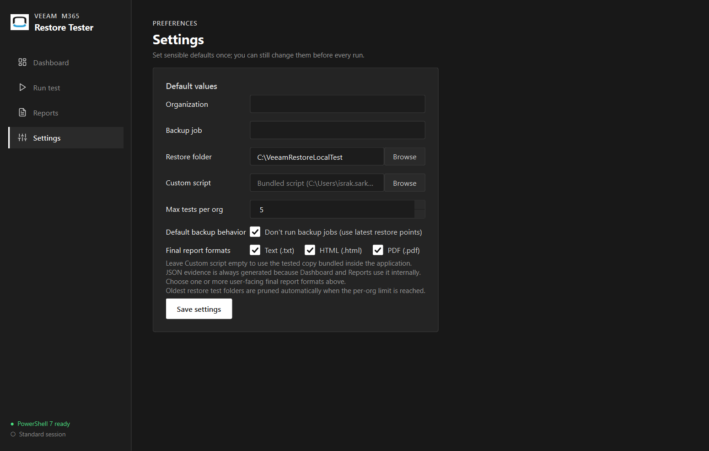

# Veeam M365 Restore Tester v1.2.0

> Non-destructive Microsoft 365 backup verification with a modern Windows desktop interface, local evidence extraction and executive reporting.

[](https://learn.microsoft.com/powershell/)
[](https://www.python.org/)
[](https://doc.qt.io/qtforpython-6/)
[](https://www.microsoft.com/windows)
[](LICENSE)

Veeam M365 Restore Tester wraps the existing PowerShell restore-verification engine in a focused desktop application. It discovers local Veeam Backup for Microsoft 365 organizations and jobs, executes selected tests sequentially, streams progress in real time, and collects locally restored Exchange, OneDrive and SharePoint samples with SHA-256 evidence.

The workflow is intentionally out-of-place: it does not restore content into Microsoft 365 and does not modify tenant data.



## Highlights in v1.2.0

- Modern PySide6 desktop UI with Dashboard, Run test, Reports and Settings views.
- Automatic organization and backup-job discovery from the local VB365 server.
- Multi-organization and multi-job selection with a hierarchical checkbox tree.
- Sequential, non-blocking PowerShell execution with live color-coded logs and phase status.
- Optional backup-job execution, or fast verification from the latest existing restore point.
- Mandatory internal JSON evidence plus independently selectable TXT, HTML and PDF reports.
- Corporate-styled HTML/PDF executive reports rendered with the bundled Qt WebEngine.
- Historical report browser, direct evidence-folder access and configurable retention.
- Consistent custom confirmation, warning, error and success dialogs.
- Standalone, UAC-aware Windows executable with scripts and visual assets embedded.

## Safety model

The application is designed around four boundaries:

1. **Out-of-place extraction only.** Restore samples are written under the configured local restore root.
2. **No tenant credentials in the GUI.** Authentication and Veeam connectivity remain inside the server's installed VB365 PowerShell environment.
3. **Read-only discovery.** Startup inventory enumerates organizations and jobs but does not change Veeam configuration.
4. **Explicit interruption.** Stopping an active run requires confirmation; the child PowerShell process is terminated gracefully and killed only if it does not exit.

Production data in Microsoft 365 is never used as a restore destination.

## Requirements

- Windows 10, Windows 11, or Windows Server 2016 or later.
- PowerShell 7 available as `pwsh.exe` in `PATH`.
- Veeam Backup for Microsoft 365 8.x/8.6 installed on the same machine.
- The `Veeam.Archiver.PowerShell` module and the relevant Veeam Explorer components.
- Local permissions to connect to the VB365 service and write to the chosen restore root.
- Administrator approval when the packaged executable requests elevation.

Python is not required when using the standalone executable.

## Quick start

### Standalone executable

1. Clone or download this repository. Git LFS is required when cloning because the executable is stored as an LFS object.
2. Run `VeeamM365RestoreTester.exe` and approve the UAC prompt.
3. Wait for local organizations and jobs to appear, or use **Refresh**.
4. Select one or more jobs.
5. Leave **Don't run backup jobs** enabled to use existing restore points, or disable it to run each backup job first.
6. Select **Run selected jobs**.
7. Open the result from the completion dialog, Dashboard or Reports view.

### Python source

```powershell
python -m venv .venv
.\.venv\Scripts\Activate.ps1
python -m pip install -r requirements.txt
python main.py
```

### PowerShell CLI

The engine remains usable without the GUI:

```powershell
pwsh.exe -NoLogo -NoProfile -ExecutionPolicy Bypass `
  -File .\scripts\Invoke-SimpleM365BackupRestoreTest.ps1 `
  -OrganizationName "contoso.onmicrosoft.com" `
  -JobName "Microsoft 365 Backup" `
  -LocalRestoreRoot "C:\VeeamRestoreLocalTest" `
  -SkipBackup
```

The duplicate script at the repository root is retained for backward compatibility with earlier command examples. The packaged application uses the canonical copy under `scripts\`.

## Output layout

For a GUI batch, every selected job first receives an isolated working directory. The batch aggregator then writes the final evidence under the organization directory:

```text
C:\VeeamRestoreLocalTest\
└── <organization>\
    └── RestoreTest_YYYYMMDD_HHMMSS\
        ├── Report_Summary.json       # always generated; powers Dashboard/Reports
        ├── Report_Summary.txt        # optional
        ├── Report_Summary.html       # optional, self-contained
        ├── Report_Summary.pdf        # optional, Chromium/Qt WebEngine output
        ├── Jobs\                     # per-job execution reports/work areas
        ├── restore email\            # selected Exchange sample evidence
        ├── restore one drive\        # selected OneDrive sample evidence
        └── restore share point\      # selected SharePoint sample evidence
```

TXT, HTML and PDF can be enabled independently in Settings. JSON cannot be disabled because it is the application’s internal historical evidence format. Retention is applied per organization to directories matching `RestoreTest_YYYYMMDD_HHMMSS`; the default is the five newest tests.

## Technical architecture

### Component map

| Component | Responsibility |
|---|---|
| `main.py` | Creates the Qt application, selects Fusion styling, loads the icon/font and opens the main window. |
| `app.py` | Coordinates navigation, job selection, the pending-job queue, execution lifecycle, report views and Settings. |
| `ui/theme.py` | Central dark-theme stylesheet and visual tokens. |
| `ui/widgets.py` | Reusable navigation, job-tree, log and status widgets. |
| `ui/dialogs.py` | Frameless application-native confirmations, errors, warnings and completion dialogs. |
| `core/discovery.py` | Runs the inventory helper asynchronously and validates its marked JSON payload. |
| `core/runner.py` | Starts/stops the restore engine with `QProcess`, streams merged output and translates log milestones into UI phases. |
| `core/batch_report.py` | Merges per-job results, selects usable evidence and writes the final batch summary. |
| `core/html_report.py` | Generates the self-contained branded executive HTML report. |
| `core/pdf_report.py` | Loads report HTML in Qt WebEngine and prints it to PDF. |
| `core/reports.py` | Discovers and parses historical `Report_Summary.json` files. |
| `core/retention.py` | Removes the oldest matching test folders after a completed batch. |
| `core/config.py` | Loads defaults and atomically persists supported settings. |
| `core/paths.py` | Resolves source-tree and PyInstaller `_MEIPASS` resource paths plus `pwsh.exe`. |
| `scripts/Get-VeeamM365Inventory.ps1` | Read-only organization/job inventory for the local VB365 installation. |
| `scripts/Invoke-SimpleM365BackupRestoreTest.ps1` | Existing backup/restore verification engine and per-job evidence producer. |

### Runtime flow

```text
Application start
  -> Get-VeeamM365Inventory.ps1
  -> validated organization/job JSON
  -> checkbox selection in the GUI
  -> PendingJob queue
  -> one QProcess invocation per selected job
  -> per-job Report_Summary.json files
  -> Python batch aggregation and evidence copy
  -> mandatory JSON + selected TXT/HTML/PDF outputs
  -> retention cleanup
  -> Dashboard and Reports refresh
```

Jobs are deliberately processed sequentially. This avoids multiple restore sessions competing for the same local Veeam services and keeps logs/evidence attributable to one organization and job at a time. Qt's event loop remains responsive because both discovery and restore execution use `QProcess` rather than blocking Python subprocess calls.

The restore runner starts PowerShell with the following boundary:

```text
pwsh.exe -NoLogo -NoProfile -NonInteractive -ExecutionPolicy Bypass
  -File <script>
  -OrganizationName <tenant>
  -JobName <job>
  -LocalRestoreRoot <job-working-folder>
  [-SkipBackup]
```

Standard output and error are merged so ordering is preserved in the live log. `[OK]`, `[WARN]` and `[ERR]` markers determine log color; known PowerShell milestones update the current phase shown in the UI.

### Discovery protocol

`Get-VeeamM365Inventory.ps1` connects to the local VB365 service, enumerates organizations and their jobs, serializes a compact JSON payload and disconnects in `finally`. Python accepts only an object containing an `Organizations` array. The marker-based extraction allows ordinary PowerShell/Veeam informational output to coexist with the machine-readable payload.

### Reporting and evidence aggregation

Each job is executed under `<batch>/Jobs/<safe-organization>/<safe-job>`. The aggregator reads only a report produced after that job started and verifies that its `JobName` matches the queued job. It then calculates overall status from the selected subset, groups results by organization, copies representative workload evidence to the final test folder and emits the summary.

HTML reports embed their styling and brand assets. PDF creation uses `QWebEngineView.printToPdf`, so PyInstaller must include Qt WebEngine and its Chromium helper process. This is also why the standalone executable is significantly larger than a basic PySide6 application.

### Configuration

Settings are stored at:

```text
%APPDATA%\VeeamM365RestoreTester\settings.json
```

The file contains only supported application preferences: selected jobs, restore root, optional custom script path, appearance, retention limit, backup-skip default and report formats. Saving uses a temporary file followed by an atomic replace. Credentials and tenant secrets are not stored.

| Setting | Default |
|---|---|
| Restore root | `C:\VeeamRestoreLocalTest` |
| Maximum tests per organization | `5` |
| Skip backup jobs | `true` |
| User-facing report formats | `txt`, `html`, `pdf` |
| Appearance | `dark` |

### Packaging

`build.ps1` invokes PyInstaller 6 in one-file, windowed mode and embeds both PowerShell scripts, icons, logos and UI SVG/PNG assets. The executable manifest requests administrator elevation with `--uac-admin`. File and product version metadata comes from `version_info.txt`.

```powershell
.\build.ps1
```

Output:

```text
dist\VeeamM365RestoreTester.exe
```

The checked-in v1.2.0 executable is approximately 197 MiB because it includes Python, Qt 6 and the Qt WebEngine/Chromium runtime required for PDF reports. It is tracked with Git LFS to remain compatible with GitHub's normal file-size limit.

### Repository layout

```text
.
├── app.py
├── main.py
├── core\
├── ui\
├── assets\
├── scripts\
├── tests\
├── tools\
├── examples\
├── build.ps1
├── VeeamM365RestoreTester.spec
├── version_info.txt
├── requirements.txt
└── VeeamM365RestoreTester.exe
```

## Build and test

Install the pinned build dependencies:

```powershell
python -m pip install -r requirements.txt
```

Run the automated suite:

```powershell
python -m pytest -q
```

The suite covers configuration persistence, inventory parsing, report discovery, retention, multi-job aggregation, selective output formats, HTML generation and asynchronous PDF generation. Veeam-integrated restore testing still requires a configured Windows/VB365 host.

Build the executable:

```powershell
.\build.ps1
```

## Version integrity

The repository executable and `version_info.txt` identify this release as **1.2.0**.

Published executable SHA-256:

```text
F85A11F9F5FDF5B679CAE558B9455E171C724B5659CB1874271BCB1C38CD5C94
```

You can verify it with:

```powershell
Get-FileHash .\VeeamM365RestoreTester.exe -Algorithm SHA256
```

## License

Distributed under the [MIT License](LICENSE).
